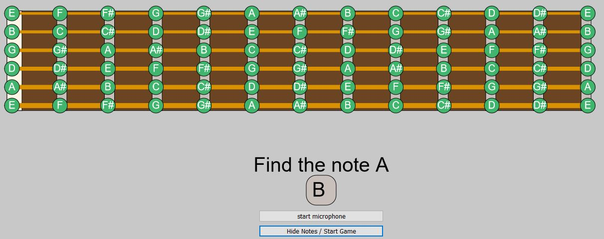

# Fretboard note training game

A simple application developed while playing with P5js and combining libraries.

The example works by allowing a microphone to connect to the browser with permissions.

In my case, I am using a rocksmith usb cable to keep the input limited to that of the guitar.

The input of the guitar is put through the ml5js library and it presents a pitch/frequency.  This is mapped to a midi code and is presented as a note on the scale on the UI.  The idea is to help find the note requested without the aid of the fretboard diagram.

This is still a work in progress and needs a noise gate to stop the note detection being a little sensitive.  Right now, volume control on the guitar and string muting is my friend while this is figured out.

----

## resources

p5js: https://p5js.org/  
ml5js: https://ml5js.org/  
pitch detection: https://learn.ml5js.org/#/reference/pitch-detection
